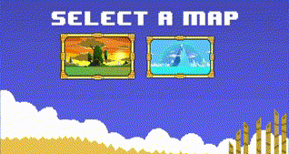

<!-- PROJECT LOGO -->
<br />
<div align="center">
  <a href="https://github.com/aaroncxsstro/AdventureTimeFight">
    
  </a>

<h3 align="center">ADVENTURE TIME FIGHT</h3>

  <p align="center">
AdventureTimeFight is a small showcase of JavaFX interface development skills. Immerse yourself in a simple yet engaging gaming experience that highlights proficiency in crafting user interfaces using JavaFX. Explore the world of AdventureTimeFight and witness the seamless integration of JavaFX elements, demonstrating a glimpse of the developer's expertise in creating interactive and visually appealing applications.
    <br />
    <br />
    <br />
  </p>
</div>

<!-- TABLE OF CONTENTS -->
<details>
  <summary>Table of Contents</summary>
  <ol>
    <li>
      <a href="#about-the-project">About The Project</a>
    </li>
    <li>
      <a href="#getting-started">Getting Started</a>
      <ul>
        <li><a href="#prerequisites">Prerequisites</a></li>
        <li><a href="#installation">Installation</a></li>
      </ul>
    </li>
    <li><a href="#contact">Contact</a></li>
  </ol>
</details>


## About The Project

<div align="center">
  
</div>

AdventureTimeFight is a 2D fighting game featuring beloved characters from Adventure Time. Immerse yourself in thrilling battles, whether challenging your friends or embarking on solo adventures. Experience the excitement of unleashing unique abilities and combos as you navigate through the colorful and whimsical world of Adventure Time. Get ready for epic encounters and enjoy the nostalgia of your favorite characters in this action-packed gaming adventure. Play solo for a personal challenge or gather your friends for multiplayer fun!
    <br />
    <br />
    <br />
<div align="center">
  
</div>
    <br />
    <br />
    <br />
<div align="center">
  
</div>


## Getting Started

This section provides instructions on setting up and running the AdventureTimeFight project locally. Follow these steps to ensure a smooth setup.

### Prerequisites

Ensure you have the following installed before proceeding:

* [NetBeans](https://netbeans.apache.org/download/index.html) - Integrated development environment (IDE)
* [JDK 1.8](https://www.oracle.com/java/technologies/javase/javase-jdk8-downloads.html) - Java Development Kit version 1.8

### Installation

1. Clone the repository
   ```sh
   git clone https://github.com/aaroncxsstro/AdventureTimeFight.git
<!-- USAGE EXAMPLES -->


## License

**Note:** The majority of resources used in this project are not owned by the developer and may be subject to their respective licenses.


## Contact

Aaron Castro - aaroncasstroarias@gmail.com
    <br />
Project Link: [AdventureTimeFight](https://github.com/aaroncxsstro/AdventureTimeFight)

